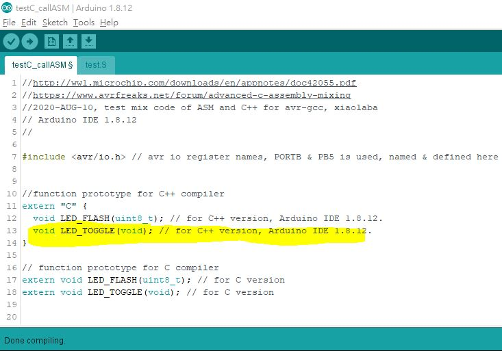

# Arduino_Cpp_call_asm_function  

  
  
    

For AVR MCU, Framework and learning, build assembler subroutine, call from C++, Arduino IDE is C++.  

Arduino IDE 1.8.12 skectch is named *.ino, considered C or C++ of programming source code, under layer is avr-gcc.  

build subrotuine, named as test.S, source code of avr assembler language for avr-gcc.  

### example and how to build/compile these two source code,
compiler : Arduino IDE 1.8.12 is used.  
hardward: Arduino Nano, onbroad LED is connected to PB5 of ATmega8/168/328p, or arduino Nano pin# D13  

### Two funcitons designed with test.S, uses LED_TOOGLE as example to describe the design flow,  
  
  
in test.S,  
// The following two lines must be included in every assembly language  
// function. They are needed to allow the use of the port names and IN and OUT instructions    
#define _SFR_ASM_COMPAT 1  
#define __SFR_OFFSET 0  
  
    
  

in test.S, define the name of fuction, LED_TOGGLE,  
```  
.global LED_TOGGLE  // avr-gcc will see this as asm subroutine and callable  
  
```  

the actual function body, 
by defualt, avr-gcc assembler subroutine, r0, r31, r18-r27, assembler rotine can be used freely,
```  
LED_TOGGLE: // start of our function  
  (your_code) // any code  
  ret       // finish of our function, return to caller, out C++ program  
  
```  

### C++ source code, testC_callASM.ino, fuction prototype & key to success,  
  
define the name before to call your function, it is saying "function prototype" also,
  
extern "C" {your_fuction_prototype} for C++ compiler  
extern your_fuction_prototype; // for C version  
  
```  
//Assembler function is external, avr-gcc uses register r24 to pass argument or parameter when calling  
  
//function prototype for C++ compiler  
extern "C" {  
  void LED_TOGGLE(void); // for C++ version, Arduino IDE 1.8.12.  
}  
  
// function prototype for C compiler  
extern void LED_TOGGLE(void); // for C version  
```  
  
  
the actual calling our ASM function,  
```  
  //LEDFLASH(value);  // parameter pass to ASM routine, r24 used   
  LED_TOGGLE(); // call ASM subroutine, no parameter  
```  
  
### test result  
compile and burn the code to Arduino Nano, onbroad LED (connrect to D13, ATmega168 port pin name is PB5) is blinking, it is same effect of Arduino blink example, but -5x is code size. ASM has unique feature that more capable & easier then C or C++ on specific jobs, for example, some algorithm design. This is jsut an example of how to build, nothing to do specific algorithm design.


### references:
how to toggle port pin, https://hackaday.com/2011/07/09/hardware-xor-for-output-pins-on-avr-microcontrollers/  
how to define asm name to call, https://stackoverflow.com/questions/16270732/gcc-linking-symbol-name-mangling-with-c-and-assembler-files  
how to Mixing Assembly and C with AVRGCC,  Atmel sold to Microchip and re-branded in year 2016, some Atmel datasheet provide by Microchip today, still Atmel brand name,   
http://ww1.microchip.com/downloads/en/appnotes/doc42055.pdf, (local copy)  
  
https://people.ece.cornell.edu/land/courses/ece4760/FinalProjects/s2012/xg46_jy363/xg46_jy363/Reference/Mixing%20C%20and%20assembly%20language%20programs.pdf  (local copy) 
  
http://www.ethernut.de/pdf/GCCAVRInlAsmCB.pdf  (local copy)  
  


